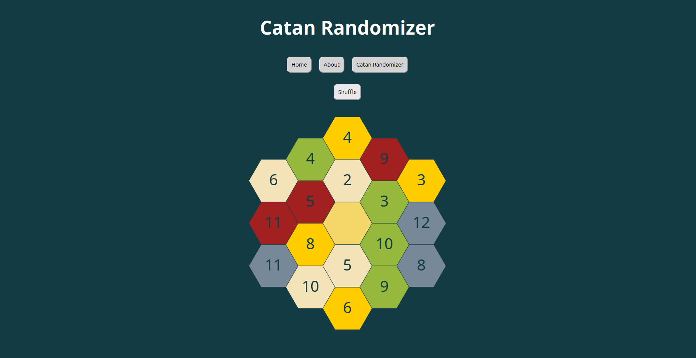

# Catan randomizer

This project was created during the Individual Hack Day at the </salt> bootcamp — inspired by my love for the board game Catan.

# What It Does

Tired of playing on the same old Catan map? This tool generates a brand new, randomized map for each game — making sure every session feels fresh and exciting. Whether you're a seasoned Settler or just getting into the game, this randomizer helps keep things unpredictable and fun.

# Try it out

Check out the project here: https://vildasiurblyte.github.io/Catan-Randomizer/

# Why I Built It

I'm a huge fan of Catan, and I wanted a simple, fun way to mix things up each time we play. So I built this randomizer to keep the strategy evolving and the gameplay interesting every time.
